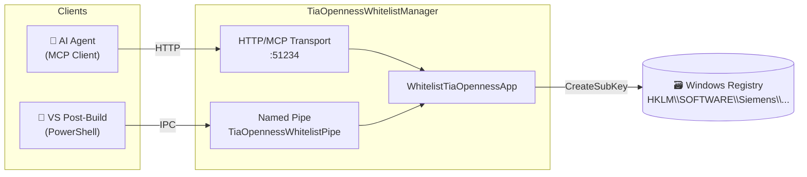

<div align="center">

# 🔐 TIA Openness Whitelist Manager

**Automate Siemens TIA Portal Openness whitelisting — from your IDE, your AI agent, or a simple script.**

[](https://github.com/RLa-gent/TiaOpennessWhitelistManager/stargazers)
[](LICENSE)
[](https://dotnet.microsoft.com/)
[]()
[](https://github.com/RLa-gent/TiaOpennessWhitelistManager/issues)
[](https://github.com/RLa-gent/TiaOpennessWhitelistManager/commits/main)

---

*An [MCP](https://modelcontextprotocol.io/) server + named-pipe service that registers executables in the TIA Portal Openness whitelist so your apps can talk to TIA Portal — no manual registry editing required.*

</div>

---

## ✨ Features

| Feature | Description |
|---|---|
| 🤖 **MCP Server** | Expose whitelisting as a tool to any MCP-compatible AI agent (GitHub Copilot, Claude, etc.) |
| 🔧 **Named Pipe** | Lightweight IPC channel for post-build scripts — no HTTP overhead |
| ⚡ **Native AOT** | Single-file, ahead-of-time compiled binary — no runtime installation required, instant startup |
| 🛡️ **Admin Guard** | Refuses to run without elevated privileges — fail-fast, clear error messages |
| 📜 **Post-Build Script** | Drop-in PowerShell script for automatic whitelisting on every Visual Studio build |
| 🔄 **Dual Transport** | HTTP/MCP + Named Pipe run side-by-side; graceful fallback to pipe-only mode |

---

## 🏗️ Architecture



---

## 🚀 Quick Start

### Prerequisites

| Requirement | Details |
|---|---|
| **OS** | Windows (registry access required) |
| **Privileges** | Run as **Administrator** |
| **.NET SDK** | [.NET 10 SDK](https://dotnet.microsoft.com/download/dotnet/10.0) (build only) |

### Download & Run

Grab the latest single-file executable from [**Releases**](https://github.com/RLa-gent/TiaOpennessWhitelistManager/releases), then:

```powershell
# Right-click → "Run as Administrator", or from an elevated terminal:
.\TiaOpennessWhitelistManager.exe          # default port 51234
.\TiaOpennessWhitelistManager.exe 42069    # custom port
```

### Build from Source

```powershell
git clone https://github.com/RLa-gent/TiaOpennessWhitelistManager.git
cd TiaOpennessWhitelistManager
dotnet publish -c Release
```

> The published binary lands in `bin/Release/net10.0-windows/win-x64/publish/`.

### 📦 About the Binary Size

The published single-file executable is **~18 MB**. That may seem large for an app with only three source files, but it is expected for Native AOT — here's why:

| What's inside | Why it's there |
|---|---|
| .NET runtime (GC, thread pool, type system) | Native AOT bundles the entire runtime — nothing to install on the target machine |
| ASP.NET Core + Kestrel | Full HTTP server stack required for the MCP transport |
| `ModelContextProtocol.AspNetCore` | MCP protocol implementation — SSE, JSON-RPC, tool dispatch |
| `Microsoft.Extensions.Hosting` + Windows Service | Host lifecycle, dependency injection, SCM integration |
| `System.Security.Cryptography` | SHA-256 hashing for the whitelist entry |
| `Microsoft.Win32` / pipe ACL code | Registry access and named pipe security descriptors |

> [!TIP]
> For comparison: a traditional self-contained (non-AOT) .NET 10 publish of the same app would be **~80–100 MB**. A framework-dependent build would be only ~1 MB, but requires .NET 10 installed on the target machine. At 18 MB, Native AOT sits comfortably in between — one file, zero prerequisites, instant startup.
>
> Size is already minimised by `<OptimizationPreference>Size</OptimizationPreference>`, `<StripSymbols>true</StripSymbols>`, and `<InvariantGlobalization>true</InvariantGlobalization>` in the project file.

### Install as a Windows Service (auto-start)

From an **elevated** (Administrator) terminal:

```powershell
# Create the service (adjust the path to your published binary)
sc.exe create TiaOpennessWhitelist `
    binPath= "C:\Tools\TiaOpennessWhitelistManager.exe" `
    start= auto `
    DisplayName= "TIA Openness Whitelist Manager"

# (Optional) Start parameters
    binPath= "C:\Tools\TiaOpennessWhitelistManager.exe --pipe-only"
# (Optional) Add a description
sc.exe description TiaOpennessWhitelist "Automatically whitelists executables for Siemens TIA Portal Openness API access."

# Start the service
sc.exe start TiaOpennessWhitelist
```

> [!NOTE]
> The service runs under **Local System** by default, which has Administrator privileges.
> To pass a custom port, append it to the binary path: `binPath= "C:\Tools\TiaOpennessWhitelistManager.exe 51234"`
> To skip the MCP HTTP server entirely and run the named pipe only: `binPath= "C:\Tools\TiaOpennessWhitelistManager.exe --pipe-only"`

**Manage the service:**

```powershell
sc.exe stop TiaOpennessWhitelist     # Stop
sc.exe delete TiaOpennessWhitelist   # Uninstall
Get-Service TiaOpennessWhitelist     # Check status in PowerShell
```

---

## 🔌 Usage

### Option 1 — MCP Client (AI Agent)

Point any MCP-compatible client to the server:

```json
{
  "mcpServers": {
    "tia-whitelist": {
      "url": "http://localhost:51234/sse"
    }
  }
}
```

The `WhitelistTiaOpennessApp` tool becomes available to the agent with two parameters:

| Parameter | Type | Example | Description |
|---|---|---|---|
| `executablePath` | `string` | `C:\MyApp\bin\MyApp.exe` | Absolute path to the executable |
| `tiaVersion` | `string` | `21.0` | TIA Portal version (`≥ 21.0` uses the new `AllowList` path) |

### Option 2 — Visual Studio Post-Build Event

1. Copy `whitelist-postbuild.ps1` into your project directory.
2. Add this **post-build event** in your `.csproj`:

```xml
<Target Name="WhitelistForTIA" AfterTargets="Build">
  <Exec Command="powershell -ExecutionPolicy Bypass -File &quot;C:\Tools\whitelist-postbuild.ps1&quot; -ExecutablePath &quot;$(TargetPath)&quot; -TiaVersion &quot;21.0&quot;" />
</Target>
```

3. Make sure the Whitelist Manager is running before you build.

### Option 3 — Direct Named Pipe (any language)

Connect to `\\.\pipe\TiaOpennessWhitelistPipe` and send two newline-delimited UTF-8 lines:

```
C:\MyApp\bin\MyApp.exe
21.0
```

Read back one line: `Success: ...` or `Error: ...`.

---

## ⚙️ How It Works

1. **Hash & Timestamp** — The tool reads the target `.exe`, computes its **SHA-256** hash and **last-modified UTC** timestamp.
2. **Registry Write** — It writes `Path`, `DateModified`, and `FileHash` to the correct `HKEY_LOCAL_MACHINE` registry key:
   - **TIA ≥ 21.0** → `SOFTWARE\Siemens\Automation\Openness\AllowList\{app}\Entry`
   - **TIA < 21.0** → `SOFTWARE\Siemens\Automation\Openness\V{version}\Whitelist\{app}\Entry`
3. **Result** — Returns a success/error string to the caller.

---

## 🔒 Security Notes

- The service **must** run as Administrator — it writes to `HKEY_LOCAL_MACHINE`.
- The named pipe grants `ReadWrite` to **Authenticated Users** and `FullControl` to **Administrators**.
- CORS is configured to allow all origins for local development. Restrict this in production if needed.

---

## 📁 Project Structure

```
TiaOpennessWhitelistManager/
├── Program.cs                          # Entry point, host config, admin check
├── TiaOpennessWhitelistTools.cs        # MCP tool: WhitelistTiaOpennessApp
├── TiaOpennessWhitelistPipeService.cs  # Named-pipe background service
├── whitelist-postbuild.ps1             # PowerShell client for VS post-build
├── TiaOpennessWhitelistManager.csproj  # Project file (Native AOT, .NET 10)
└── LICENSE                             # MIT License
```

---

## 🤝 Contributing

Contributions are welcome! Feel free to:

1. 🍴 **Fork** the repository
2. 🌿 Create a **feature branch** (`git checkout -b feature/amazing-feature`)
3. 💾 **Commit** your changes (`git commit -m 'Add amazing feature'`)
4. 📤 **Push** to the branch (`git push origin feature/amazing-feature`)
5. 🔃 Open a **Pull Request**

Please open an [issue](https://github.com/RLa-gent/TiaOpennessWhitelistManager/issues) first for major changes so we can discuss the approach.

---

## 📝 License

Distributed under the **MIT License**. See [`LICENSE`](LICENSE) for details.

---

<div align="center">

**If this project saves you from manual accepting each new build, consider giving it a ⭐**

Made with ❤️ for the TIA Portal automation community

</div>
